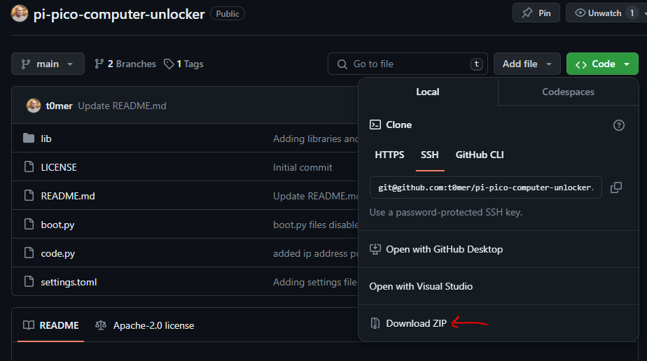

# pi-pico-computer-unlocker
In today's digital age, remote access to computers has become increasingly vital.
Whether you're managing multiple devices or accessing a workstation from a distance, streamlined authentication processes are key.
The pi-pico-computer-unlocke project leverages the power of Raspberry Pi Pico, coupled with CircuitPython and MQTT, to create a secure and efficient solution for remotely unlocking computers.

## Getting started

### Flash the raspberry pi with circuitpython
Before we can run the project on the raspberry pi, we need to flush it with the circuitpython firmware for raspberry pi pico w.
To do so, please follow the following steps:

* Download the latest version of the [circuitpython](https://circuitpython.org/board/raspberry_pi_pico_w/).
* Hold down the BOOTSEL button, and while continuing to hold it (don't let go!), plug the Pico into the USB. ntinue to hold the BOOTSEL button until the RPI-RP2 drive appears!

* You will see a new disk drive appear called RPI-RP2. Drag the adafruit_circuitpython_etc.uf2 file to RPI-RP2.
*The RPI-RP2 drive will disappear and a new disk drive called CIRCUITPY will appear.

That's it, you're done!

### Flash Resetting UF2
If your Pico enters an unusual state and fails to appear as a disk drive during the installation of CircuitPython, consider using this ['nuke' UF2 file.](https://cdn-learn.adafruit.com/assets/assets/000/099/419/original/flash_nuke.uf2?1613329170) It performs a thorough cleansing of your Flash Memory, erasing all files on the board, but it will help restore functionality. After this process, proceed to reinstall CircuitPython.

### Install the unlocker program to the raspberry pi pico w
Now it is time to install the unlocker. go the the unlocker github trpository: https://github.com/t0mer/pi-pico-computer-unlocker.

Click on "Code" and then "Download ZIP":

