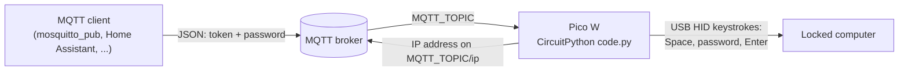

# pi-pico-computer-unlocker

[](LICENSE)

Unlock your computer remotely with a Raspberry Pi Pico W. The Pico W runs CircuitPython, plugs into
the computer's USB port and acts as a USB keyboard. It connects to your Wi-Fi network and subscribes
to an MQTT topic. When it receives a message with the correct token, it wakes the lock screen, types
the password from the message and presses Enter.

It is meant for home-lab and home-automation users who want to unlock their own machine from an
MQTT client, Home Assistant or any other automation that can publish MQTT messages.

> [!WARNING]
> This device types a secret into your computer on command. Anyone who can publish to its MQTT topic
> with the right token can unlock that computer. Read the [Security](#security) section before you
> use it, and only use it on machines you own.

https://github.com/t0mer/pi-pico-computer-unlocker/assets/4478920/e89226e9-75db-4400-ba72-b8b46c49add6

## Table of contents

- [Features](#features)
- [Demo](#demo)
- [Hardware](#hardware)
- [How it works](#how-it-works)
- [Requirements](#requirements)
- [Installation](#installation)
- [Configuration](#configuration)
- [Usage](#usage)
- [Troubleshooting](#troubleshooting)
- [Updating or removing the program](#updating-or-removing-the-program)
- [Security](#security)
- [Known issues and limitations](#known-issues-and-limitations)
- [Project layout](#project-layout)
- [Contributing](#contributing)
- [License](#license)
- [Disclaimer](#disclaimer)

## Features

- Appears to the computer as a standard USB HID keyboard, so no software or driver is needed on the
  computer.
- Connects to Wi-Fi and subscribes to one MQTT topic.
- Accepts a JSON message with a `token` and a `password`. It types the password only when the token
  matches the `TOKEN` value in `settings.toml`.
- Unlock sequence: presses **Space** to wake the lock screen, waits 1 second, types the password,
  waits 1 second, then presses **Enter**.
- Supports 13 keyboard layouts (US plus 12 Windows layouts), selected with `HID_LAYOUT`.
- Publishes its IP address to `<MQTT_TOPIC>/ip` after it connects, so you can check that it is
  online.
- `boot.py` hides the `CIRCUITPY` USB drive, so the computer sees only a keyboard (and the serial
  console), not the files with your settings.
- The unlock password is not stored on the device. It arrives in each MQTT message.

## Demo

The video at the top of this page shows the unlocker in action. You can also download or watch it
as an MP4 file:

- [Watch `unlocker.mp4` on GitHub](https://github.com/t0mer/pi-pico-computer-unlocker/blob/main/videos/unlocker.mp4)
- Relative path in the repository: [`videos/unlocker.mp4`](videos/unlocker.mp4)

## Hardware

- **Raspberry Pi Pico W.** Wi-Fi is required, so the plain Raspberry Pi Pico (without the W) does
  not work.
- A micro-USB **data** cable (charge-only cables won't work) to connect the Pico W to the computer
  you want to unlock.
- A 2.4 GHz Wi-Fi network (the Pico W radio does not support 5 GHz).

No soldering or extra parts are needed. The code does not use the on-board LED, so the LED gives no
status information.

## How it works


```mermaid
flowchart LR
    P["MQTT client<br/>(mosquitto_pub, Home Assistant, ...)"] -- "JSON: token + password" --> B[("MQTT broker")]
    B -- "MQTT_TOPIC" --> D["Pico W<br/>CircuitPython code.py"]
    D -- "IP address on MQTT_TOPIC/ip" --> B
    D -- "USB HID keystrokes:<br/>Space, password, Enter" --> C["Locked computer"]
```

1. **Boot (`boot.py`).** Runs once at power-up and calls `storage.disable_usb_drive()`. The
   `CIRCUITPY` drive is no longer shown to the computer. The USB serial console (CDC) is not
   changed and stays available.
2. **Wi-Fi.** `code.py` connects to `WIFI_SSID` with `WIFI_PASSWORD` and prints its IP address on
   the serial console.
3. **MQTT.** It connects to `MQTT_BROKER` on `MQTT_PORT` (keep-alive of 60 seconds), subscribes to
   `MQTT_TOPIC` and publishes its IP address to `MQTT_TOPIC/ip` once.
4. **Message handling.** Each message on `MQTT_TOPIC` is parsed as JSON. The `token` field is
   compared with the `TOKEN` setting as a plain string.
   - If it matches, the device presses **Space**, waits 1 second, types the `password` field with
     the layout selected by `HID_LAYOUT`, waits 1 second and presses **Enter**.
   - If it does not match, it prints `Invalid token.` on the serial console and does nothing.
5. **Loop.** It polls the broker in a loop. If the Wi-Fi connection fails, the program stops. The
   MiniMQTT library retries the first MQTT connection a few times with backoff, but nothing
   reconnects after start-up: if the connection drops, the program stops and the device must be
   unplugged and plugged back in (see [Known issues](#known-issues-and-limitations)).

## Requirements

- Raspberry Pi Pico W (see [Hardware](#hardware)).
- **CircuitPython 9.x** for the Raspberry Pi Pico W. The bundled compiled library
  (`adafruit_minimqtt/*.mpy`) uses the CircuitPython 9 `.mpy` format, so it won't load on
  CircuitPython 8.x or older. <!-- TODO: verify compatibility with CircuitPython 10.x -->
- An MQTT broker reachable from the Pico W's Wi-Fi network (for example Mosquitto or the Home
  Assistant Mosquitto add-on).
- A computer that accepts USB keyboards on its lock screen, with a keyboard layout that matches
  `HID_LAYOUT`.

### Bundled libraries (`lib/`)

The `lib/` folder already contains everything `code.py` needs:

| Library | Version | Used for |
|---------|---------|----------|
| `adafruit_hid` | unknown (not recorded in the bundled files) | USB keyboard, keycodes and keyboard layouts |
| `adafruit_minimqtt` | 7.6.3 (`.mpy`, CircuitPython 9 format) | MQTT client |
| `adafruit_connection_manager` | 1.1.0 | Socket handling, required by MiniMQTT |
| `adafruit_requests` | 3.2.5 | Not used by `code.py` |

The `*.dist-info` folders (including one for `adafruit_blinka` 8.39.1) only contain package metadata
and are not needed on the device.

## Installation

### 1. Flash CircuitPython on the Pico W

1. Download the latest CircuitPython 9.x `.uf2` file for the
   [Raspberry Pi Pico W](https://circuitpython.org/board/raspberry_pi_pico_w/).
2. Hold down the **BOOTSEL** button and, while you keep holding it, plug the Pico W into the USB
   port. Keep holding the button until the `RPI-RP2` drive appears.

   

3. Drag the downloaded `adafruit-circuitpython-raspberry_pi_pico_w-*.uf2` file to the `RPI-RP2`
   drive.
4. The `RPI-RP2` drive disappears and a new drive called `CIRCUITPY` appears.

#### Resetting the flash (optional)

If your Pico W gets into an unusual state and doesn't show up as a drive while you install
CircuitPython, use this ['nuke' UF2 file](https://cdn-learn.adafruit.com/assets/assets/000/099/419/original/flash_nuke.uf2?1613329170).
It erases the whole flash memory, including all files on the board, and restores the board to a
working state. After that, install CircuitPython again.

### 2. Copy the unlocker files

1. Download this repository: click **Code** and then **Download ZIP**, or clone it with Git.

   

2. Unzip the file and edit `settings.toml` (see [Configuration](#configuration)).
3. Copy these files and folders to the root of the `CIRCUITPY` drive:

   

   - `lib/`: the libraries the program needs.
   - `boot.py`: hides the `CIRCUITPY` drive from the computer.
   - `code.py`: the main program.
   - `settings.toml`: your settings.

   `screenshots/`, `videos/`, `LICENSE` and `README.md` are not needed on the device.

4. Make sure the files are fully written, then unplug the Pico W and plug it back in. `boot.py`
   runs at start-up, so the `CIRCUITPY` drive no longer appears. This is expected.

> [!TIP]
> Copy `boot.py` **last**, after you have checked `settings.toml`. Once `boot.py` is active, you
> can't reach the files over the USB drive anymore (see
> [Updating or removing the program](#updating-or-removing-the-program)).

## Configuration

All settings live in `settings.toml` on the device. CircuitPython reads them with `os.getenv()`.
Strings must be in double quotes; `MQTT_PORT` is a number without quotes.

```toml
WIFI_SSID = "<your-wifi-ssid>"
WIFI_PASSWORD = "<your-wifi-password>"
# MQTT Broker settings
MQTT_BROKER = "<broker-hostname-or-ip>"
MQTT_PORT = 1883
MQTT_USERNAME = "<mqtt-username>"
MQTT_PASSWORD = "<mqtt-password>"
MQTT_TOPIC = "<your/unlock/topic>"
TOKEN = "<long-random-token>"
HID_LAYOUT = "US"
```

| Key | Required | Format | Default | Description |
|-----|----------|--------|---------|-------------|
| `WIFI_SSID` | Yes | String | none | Name of the 2.4 GHz Wi-Fi network. |
| `WIFI_PASSWORD` | Yes | String | none | Wi-Fi password. |
| `MQTT_BROKER` | Yes | String (hostname or IP address) | none | Address of the MQTT broker. |
| `MQTT_PORT` | No | Integer, no quotes | `1883` if the key is missing | Broker port. The shipped `settings.toml` sets `1883`. See [Security](#security) about TLS. |
| `MQTT_USERNAME` | No | String | none | Broker username, if your broker needs authentication. Set it together with `MQTT_PASSWORD`, or leave both out. |
| `MQTT_PASSWORD` | No | String | none | Broker password, if your broker needs authentication. Set it together with `MQTT_USERNAME`, or leave both out. |
| `MQTT_TOPIC` | Yes | String (MQTT topic, no wildcards) | none | Topic the device subscribes to for unlock messages. The device also publishes its IP address to `<MQTT_TOPIC>/ip`. |
| `TOKEN` | Strongly recommended (not enforced) | String | none | Shared secret. A message is acted on only when its `token` field is exactly equal to this value. Use a long random value, for example from `openssl rand -hex 32`. **Never leave `TOKEN` empty or unset.** The code doesn't enforce it, and without a strong value the token check gives no protection (see [Security](#security)). |
| `HID_LAYOUT` | Yes | One of the codes below | none (the shipped file sets `"US"`) | Keyboard layout used to type the password. It must match the keyboard layout that the computer uses on its lock screen. |

`MQTT_USERNAME` and `MQTT_PASSWORD` must be set together or both left out. A username without a
password makes the program crash, and a password without a username is ignored. Empty strings are
sent to the broker as real (empty) credentials, not as an anonymous login, so if your broker allows
anonymous access, remove or comment out both lines.

### Supported keyboard layouts

`HID_LAYOUT` is case-sensitive and must be one of these codes. Any other value (or a missing key)
stops the program with `ValueError: Unsupported or undefined keyboard layout`. There is no automatic
fallback to US.

| Code | Layout (from the `adafruit_hid` module name) |
|------|----------------------------------------------|
| `US` | US English (`keyboard_layout_us`) |
| `UK` | UK English, Windows (`keyboard_layout_win_uk`) |
| `BR` | Brazilian, Windows (`keyboard_layout_win_br`) |
| `CZ` | Czech, Windows (`keyboard_layout_win_cz`) |
| `DA` | Danish, Windows (`keyboard_layout_win_da`) |
| `DE` | German, Windows (`keyboard_layout_win_de`) |
| `ES` | Spanish, Windows (`keyboard_layout_win_es`) |
| `FR` | French, Windows (`keyboard_layout_win_fr`) |
| `HU` | Hungarian, Windows (`keyboard_layout_win_hu`) |
| `IT` | Italian, Windows (`keyboard_layout_win_it`) |
| `PO` | Portuguese, Windows (`keyboard_layout_win_po`) |
| `SW` | Swedish, Windows (`keyboard_layout_win_sw`) |
| `TR` | Turkish, Windows (`keyboard_layout_win_tr`) |

`lib/adafruit_hid/` also contains `keyboard_layout_mac_fr`, `keyboard_layout_us_dvo` and
`keyboard_layout_win_cz1`, but `code.py` does not map them to a `HID_LAYOUT` code.

## Usage

### Check that the device is online

After it connects, the unlocker publishes its IP address (as plain text) to `<MQTT_TOPIC>/ip`. The
message is not retained, so subscribe before you plug the device in:

```bash
mosquitto_sub -h <broker> -p 1883 -u <mqtt-username> -P <mqtt-password> -t '<your/unlock/topic>/ip' -v
```

In an MQTT client such as MQTT Explorer, a `<your/unlock/topic>/ip` entry appears under your topic,
and its value is the device's IP address on your network (for example `192.168.x.x`).

There is no web interface on the device. The IP address is only for information.

### Unlock the computer

Publish a JSON message to `MQTT_TOPIC`:

```json
{
  "token": "<your-TOKEN-from-settings.toml>",
  "password": "<computer-password>"
}
```

- `token`: must be exactly the `TOKEN` value from `settings.toml`. This checks that the message
  comes from an authorized sender.
- `password`: the password (or PIN) of the computer you want to unlock. Every character must exist
  in the selected `HID_LAYOUT`.

Both fields are required. Don't publish the message as **retained** (see [Security](#security)).

#### mosquitto_pub

```bash
mosquitto_pub -h <broker> -p 1883 -u <mqtt-username> -P <mqtt-password> \
  -t '<your/unlock/topic>' \
  -m '{"token": "<your-token>", "password": "<computer-password>"}'
```

Commands like this can end up in your shell history. Consider reading the payload from a protected
file with `-f <payload-file>` instead of `-m`.

#### Home Assistant

Use the `mqtt.publish` action, for example in a script. Keep the payload in `secrets.yaml` so the
token and password aren't stored in the script itself:

```yaml
# secrets.yaml
pc_unlock_payload: '{"token": "<your-token>", "password": "<computer-password>"}'
```

```yaml
# scripts.yaml
unlock_pc:
  alias: Unlock PC
  sequence:
    - action: mqtt.publish
      data:
        topic: <your/unlock/topic>
        payload: !secret pc_unlock_payload
        retain: false
```

## Troubleshooting

All diagnostic output goes to the USB serial console, which stays enabled after `boot.py` runs.
Open it with any serial terminal (for example Mu, Thonny, PuTTY, `screen` or `tio`) to see these
messages:

| Message or symptom | Cause | What to do |
|--------------------|-------|------------|
| `ValueError: Unsupported or undefined keyboard layout` | `HID_LAYOUT` is missing or not one of the supported codes. | Set a supported code, such as `HID_LAYOUT = "US"`. |
| Program stops after `Connecting to WiFi` | Wrong `WIFI_SSID`/`WIFI_PASSWORD`, a 5 GHz-only network, or no signal. The code doesn't retry. | Fix the settings and power-cycle the device. |
| Program stops before `Connected to MQTT Broker!` | Broker unreachable, wrong port or wrong credentials. MiniMQTT retries the first connection a few times with backoff, then gives up. | Check `MQTT_BROKER`, `MQTT_PORT` and the credentials, then power-cycle. |
| `An error occurred in the MQTT loop: ...` | The MQTT connection failed or the broker dropped it after start-up. There is no automatic reconnect. | Check the broker logs, then unplug the device and plug it back in. |
| `Invalid token.` | The `token` in the message doesn't match `TOKEN`. | Check that both values are identical, including case. |
| `Missing data in message` | The JSON has no `token` or no `password` field. | Send both fields. |
| `Error decoding JSON: ...` | The payload isn't valid JSON. This message is also printed for any other error while typing, for example a password character that doesn't exist in the selected layout. | Validate the JSON and check `HID_LAYOUT`. |
| Wrong characters are typed | `HID_LAYOUT` doesn't match the keyboard layout of the lock screen. | Set `HID_LAYOUT` to the layout the computer uses. |
| The password is typed but the screen didn't wake in time | The lock screen needs more than one Space press or more than 1 second to show the password field. | Send the message again. The timings are fixed in `code.py`. |
| The `CIRCUITPY` drive doesn't appear | Expected: `boot.py` hides it. | See [Updating or removing the program](#updating-or-removing-the-program). |

## Updating or removing the program

Because `boot.py` hides the `CIRCUITPY` drive, you can't edit the files over USB storage while it
is active. To get the drive back:

1. Connect to the serial console and press **Ctrl+C** to stop `code.py`, then press any key to enter
   the REPL.
2. Restart the board in safe mode, which skips `boot.py` and `code.py`:

   ```python
   import microcontroller
   microcontroller.on_next_reset(microcontroller.RunMode.SAFE_MODE)
   microcontroller.reset()
   ```

3. The `CIRCUITPY` drive appears. Edit the files, or delete or rename `boot.py` to keep the drive
   visible, then unplug and replug the board.

As a last resort, the ['nuke' UF2 file](#resetting-the-flash-optional) erases everything, including
`settings.toml`, and you can start over.

## Security

This project types a secret into a computer on command. Treat the device, the broker and the token
as seriously as the computer password itself.

- **The device types a secret into your computer.** Once plugged in, it is a keyboard that anyone
  with the right token can drive. The computer can't tell its keystrokes from a real keyboard.
- **Anyone who can publish to the topic can unlock the PC.** The only check is that the `token`
  field equals `TOKEN`. Protect the topic with broker authentication and access control lists
  (ACLs) so only trusted clients can publish to it, and use a long random `TOKEN`. Never leave
  `TOKEN` empty or unset. The code doesn't enforce it, and without a strong value the token check
  gives no protection.
- **Messages are not protected against replay.** The same message unlocks the computer every time
  it is received. Anyone who can read the topic, the broker's storage or a client's history can
  reuse it.
- **Never publish unlock messages as retained.** A retained message is delivered again every time
  the device (re)connects and subscribes, so the password would be typed at every start-up. If you
  published one by mistake, clear it by publishing an empty retained message to the topic.
- **Use broker authentication and TLS where possible.** The code supports username and password
  authentication, but not TLS. It creates an SSL context, but the bundled MiniMQTT 7.6.3 defaults
  `is_ssl` to `False` and `code.py` never sets it, so the connection is plain TCP even if you set
  `MQTT_PORT` to 8883. This means the token, the computer password and the MQTT credentials travel **unencrypted** on your network.
  Keep the broker on a trusted local network, don't expose it to the internet for this purpose, and
  use a dedicated MQTT user for the device.
- **Secrets are stored in plain text on the device.** `settings.toml` holds the Wi-Fi password,
  the MQTT credentials and `TOKEN` without encryption. `boot.py` only hides the drive from the
  computer; it doesn't encrypt anything. Anyone with physical access to the Pico W can read the
  flash. The computer password is not stored on the device, but it passes through the broker and
  your MQTT clients.
- **Physical access is a risk.** The device is plugged into the computer it can unlock and is easy
  to remove. If it is lost or stolen, change `TOKEN`, the MQTT credentials and the Wi-Fi password.
- **Keep secrets out of logs and history.** Don't put real tokens or passwords in shell commands,
  screenshots, automation traces or Git. Use placeholders in examples and secret stores
  (for example Home Assistant `secrets.yaml`) for real values.
- **Only use this on machines you own** or are explicitly authorized to manage, and check that it
  is allowed by your organization's security policy.

## Known issues and limitations

These come from the current code and are documented here, not fixed:

- **No reconnect.** A Wi-Fi connection error isn't retried. MiniMQTT retries the first MQTT
  connection a few times with backoff, but nothing reconnects after start-up: any error in the MQTT
  loop stops the program until the device is power-cycled.
- **No TLS in practice.** See [Security](#security).
- **`TOKEN` isn't enforced.** The code doesn't check that `TOKEN` is set or strong. Never leave it
  empty or unset; without a strong value the token check gives no protection.
- **No default layout.** A missing or unknown `HID_LAYOUT` stops the program instead of falling
  back to US.
- **The IP address is published once and not retained.** Subscribers that connect later won't see
  it.
- **Fixed unlock sequence and timings.** Space, 1 second, password, 1 second, Enter. Lock screens
  that need a different key or a longer delay may not work.
- **Misleading error message.** Any error while handling a message, not only JSON errors, is
  printed as `Error decoding JSON: ...`.
- **No status LED.** The on-board LED isn't used.
- The Windows layouts are designed for Windows. Behaviour on macOS or Linux lock screens with
  non-US layouts isn't documented. <!-- TODO: verify on macOS/Linux -->

## Project layout

```text
.
├── boot.py          # Hides the CIRCUITPY USB drive at start-up
├── code.py          # Main program: Wi-Fi, MQTT, token check, keyboard typing
├── settings.toml    # Settings template (all values are placeholders)
├── lib/             # Bundled CircuitPython libraries
├── screenshots/     # Images used in this README
└── videos/          # Demo video (unlocker.mp4)
```

## Contributing

Issues and pull requests are welcome. Please describe the board, CircuitPython version and
computer operating system you tested with, and never include real tokens, passwords or network
details in issues, logs or screenshots.

## License

This project is licensed under the [Apache License 2.0](LICENSE).

## Disclaimer

The information in this guide is for educational and informational purposes only.

Test the system thoroughly in a controlled environment before you use it in a real-world setting.
The author and contributors are not responsible for any damage, data loss or security breaches
that may result from using this system.

You are responsible for making sure that your use complies with all applicable laws and policies
regarding access and security.
