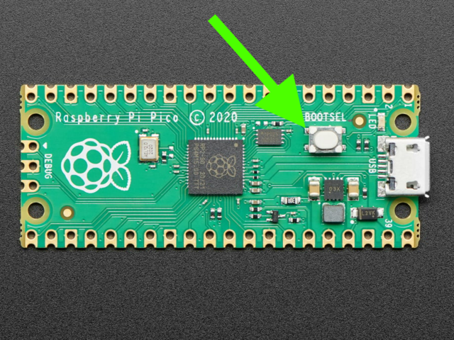

# pi-pico-computer-unlocker
In today's digital age, remote access to computers has become increasingly vital.
Whether you're managing multiple devices or accessing a workstation from a distance, streamlined authentication processes are key.
The pi-pico-computer-unlocke project leverages the power of Raspberry Pi Pico, coupled with CircuitPython and MQTT, to create a secure and efficient solution for remotely unlocking computers.

https://github.com/t0mer/pi-pico-computer-unlocker/assets/4478920/e89226e9-75db-4400-ba72-b8b46c49add6

## Getting started

### Flash the raspberry pi with circuitpython
Before we can run the project on the raspberry pi, we need to flush it with the circuitpython firmware for raspberry pi pico w.
To do so, please follow the following steps:

* Download the latest version of the [circuitpython](https://circuitpython.org/board/raspberry_pi_pico_w/).
* Hold down the BOOTSEL button, and while continuing to hold it (don't let go!), plug the Pico into the USB. ntinue to hold the BOOTSEL button until the RPI-RP2 drive appears!

* You will see a new disk drive appear called RPI-RP2. Drag the adafruit_circuitpython_etc.uf2 file to RPI-RP2.
*The RPI-RP2 drive will disappear and a new disk drive called CIRCUITPY will appear.

That's it, you're done!


### Flash Resetting UF2
If your Pico enters an unusual state and fails to appear as a disk drive during the installation of CircuitPython, consider using this ['nuke' UF2 file.](https://cdn-learn.adafruit.com/assets/assets/000/099/419/original/flash_nuke.uf2?1613329170) It performs a thorough cleansing of your Flash Memory, erasing all files on the board, but it will help restore functionality. After this process, proceed to reinstall CircuitPython.

### Install the unlocker program to the raspberry pi pico w
Now it is time to install the unlocker. go the the unlocker github trpository: https://github.com/t0mer/pi-pico-computer-unlocker.

Click on "Code" and then "Download ZIP":


Unzip the file the file and copy the following files into you Raspberry pi pico:

* lib - Contains the Requirements and Libreries nedded for the program to run.
* boot.py - Containes the code to disable the auto-mounting of the pi as a storage device.
* code.py - The main code of the program.
* settings.toml - Contains the enviroment variables settings:

```toml
WIFI_SSID = "" #Your Wifi SSID
WIFI_PASSWORD = "" #Your Wifi password
# MQTT Broker settings
MQTT_BROKER = "" #The MQTT Broker address
MQTT_PORT = 1883  # Default port for non-TLS connections
MQTT_USERNAME = ""  #MQTT Username, Not required for all brokers
MQTT_PASSWORD = ""  #MQTT Password, Not required for all brokers
MQTT_TOPIC = "" #Topic to subscribe
TOKEN = "" #Token to verify the sender of the password. you can use the online tool here: https://it-tools.techblog.co.il/token-generator
HID_LAYOUT = "US" #Default keyboard layout to use.
```

The upported layouts are:
* US (Default)
* CZ
* DA
* DE
* ES
* FR
* HU
* IT
* PO
* SW
* TR
* UK

Once done, Save the files and Dicsonnect/Reconnect the pi to the USB. The respberry pi drive should disappear.


## Working with th Unlocker
When the unlocker comes online, it publishes it's own ip adress in a MQTT topic, that way you can verify that it's online.


To Unlock the computer the only thing you should do is to publish MQTT topic with the following json:

```json
{
  "token":"bcQxAOfoW4l3yW6ur4",
  "password":"!123456!"
}
```

* token - The same token you places in the setting.toml file. This is to verify that the password sent by authorized sender.
* password - The password fo the computer you want to unlock.


# Disclaimer
The information provided in this guide is for educational and informational purposes only. Users should exercise caution and test the system thoroughly in a controlled environment before implementing it in a real-world setting. The author or contributors are not responsible for any damages, data loss, or security breaches that may occur from the use of this system. It is the user's responsibility to ensure that their usage complies with all applicable laws and policies regarding access and security.

The software and methods described are based on open-source tools, which are subject to their own licenses and restrictions. Users should ensure they comply with all such licenses and use the software in accordance with the licensing terms provided by their respective owners.

Users should be aware of the security risks associated with remote access systems and take appropriate measures to secure communications and authenticate commands. Improper implementation or misuse of the system could potentially expose users or systems to risks such as unauthorized access or data breaches.